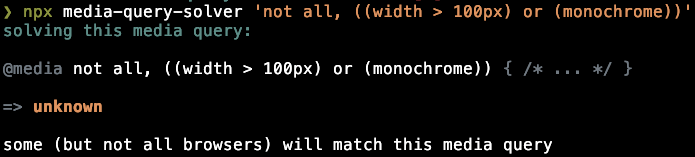

# `media-query-solver`


[](https://packagephobia.com/result?p=media-query-solver)

Solve media queries (and detect useless ones!)

> Try with `npx`:
>
> ```sh
> npx media-query-solver 'not all, ((width > 100px) or (monochrome))'
> ```
>
> 

## Install

This package is available from the `npm` registry.

```sh
npm install media-query-solver
```

## Usage

Supports JavaScript + TypeScript:

```ts
import { solveMediaQueryList } from "media-query-solver";

solveMediaQueryList(`not all`);
// => "false"
solveMediaQueryList(`all`);
// => "true"
solveMediaQueryList(`(width > 100px)`);
// => "unknown"
solveMediaQueryList(`(width > 100px)`, {
  solveUnknownFeature: () => "true",
});
// => "true"
```

Can also be imported via `require("media-query-solver")`.

## Contributing

- PRs welcome and accepted, simply fork and create
- Issues also very welcome
- Treat others with common courtesy and respect 🤝

Dev environment (for contributing) requires:

- node >= 16.14.0
- npm >= 6.8.0
- git >= 2.11

## Licence

MIT
